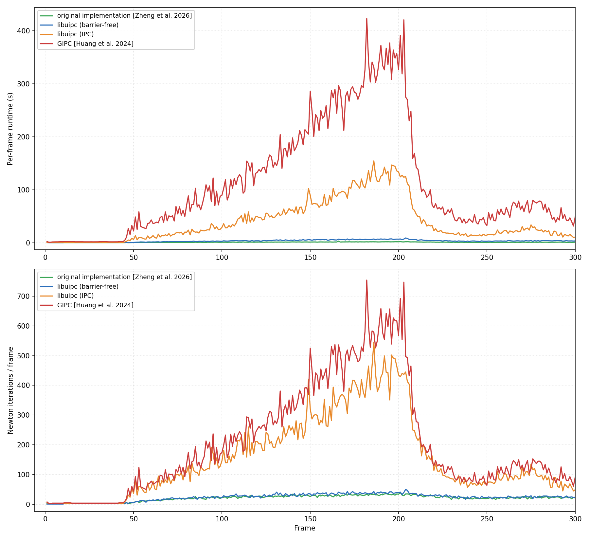
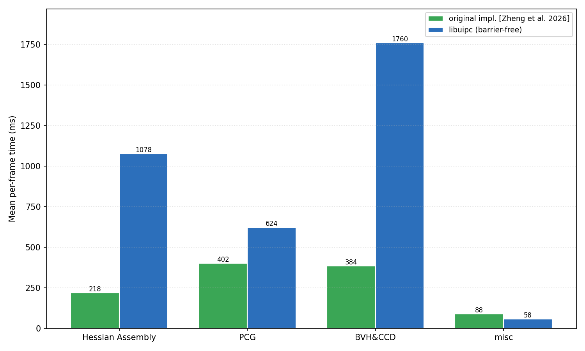

# Libuipc implementation of *Robust and Efficient Penetration-Free Elastodynamics without Barriers* [Zheng et al. 2026]

This is the official libuipc implementation of *Robust and Efficient Penetration-Free Elastodynamics without
Barriers* [Zheng et al. 2026]. Most of the features in the paper is implemented. Work still in progress:

- Penalty-free moving boundary conditions — moving boundaries currently rely on soft constraints.
- Efficient analytic PSD projection

The **animal well** scene is currently included as a benchmark. More testcases from the paper will be added once the
penalty-free moving boundary condition is complete.

To characterize this implementation, we benchmark the animal well scene (first 300 frames) against:

- the **original implementation** [Zheng et al. 2026],
- **libuipc** with the barrier-free solver (this work) and with standard **IPC**, and
- **GIPC** [Huang et al. 2024].

The barrier-free solver is on par with the original implementation in **Newton and PCG iteration counts**. The main
remaining gaps are in **Hessian assembly** and **BVH/CCD**, which we are continuing to optimize.

*If you would like access to the original implementation for academic use, please contact us.*

### Statistics

Per-frame runtime and Newton iteration counts on the animal well scene:

Mean frame time split by component (original implementation vs. libuipc barrier-free):

